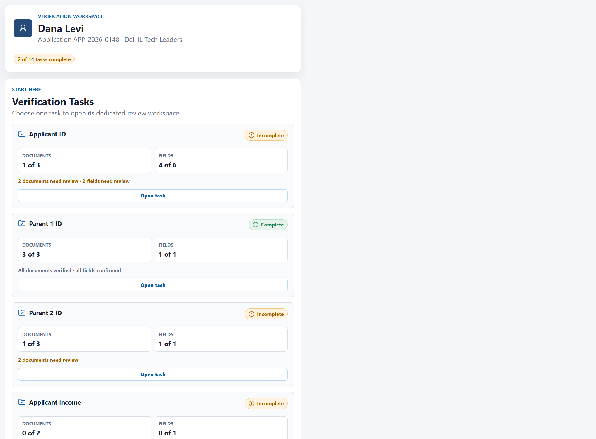
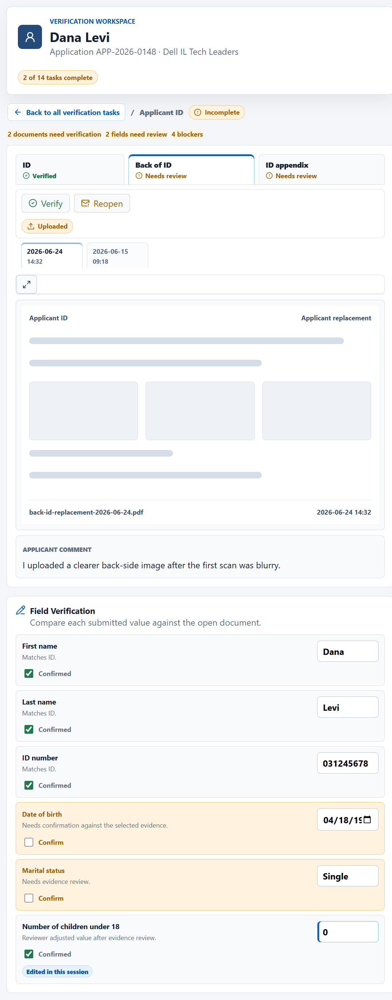
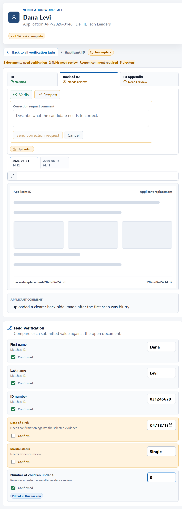
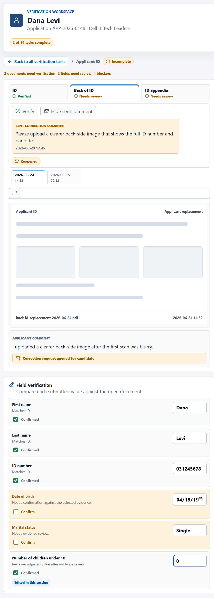
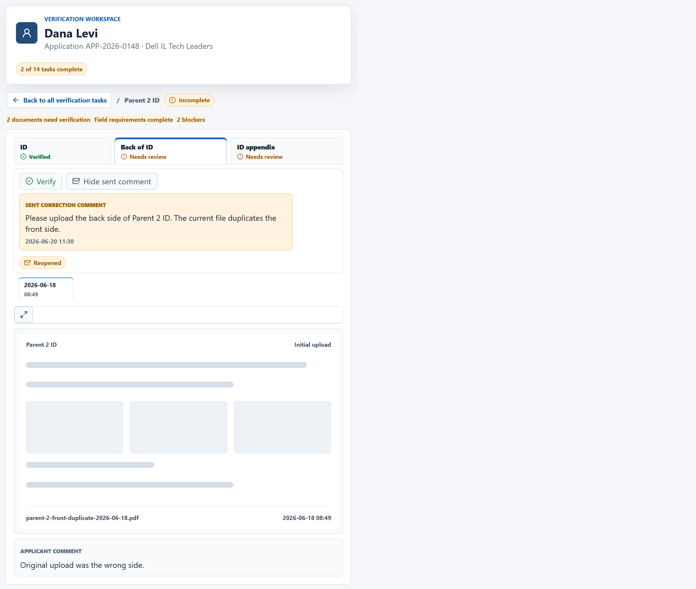
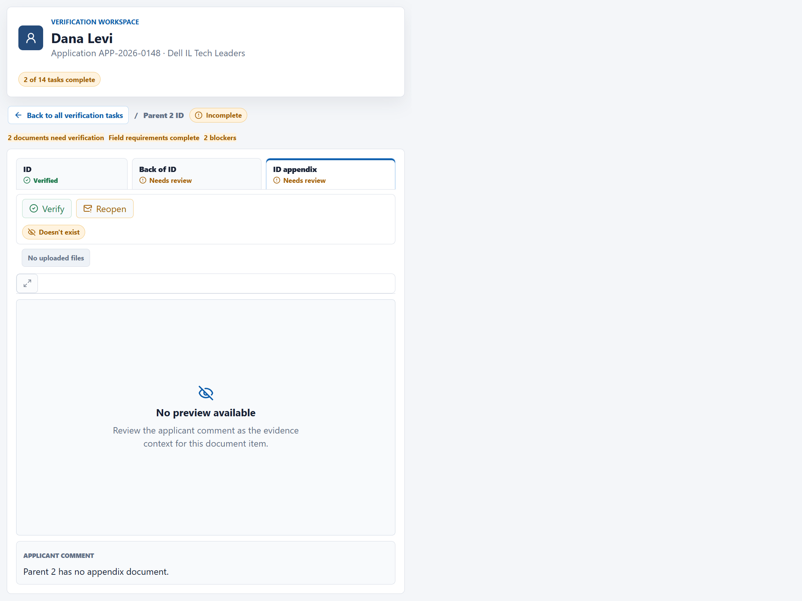
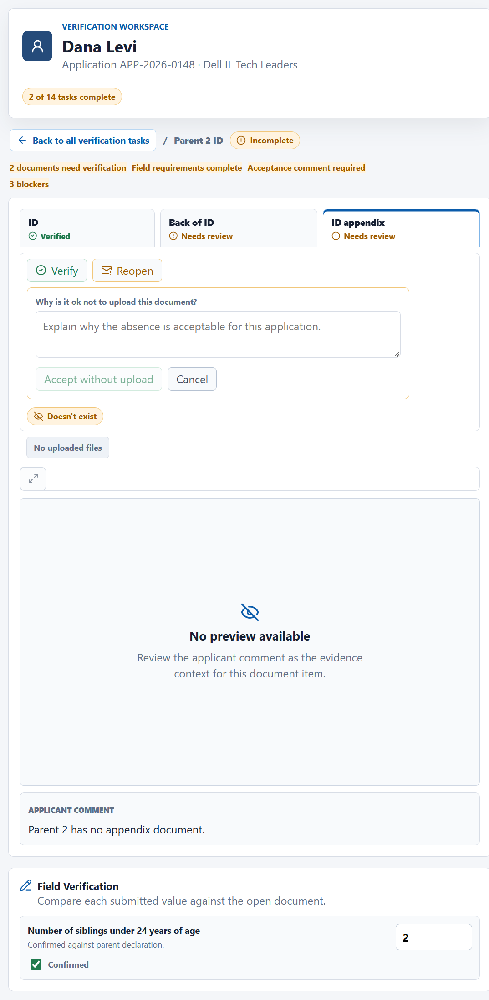
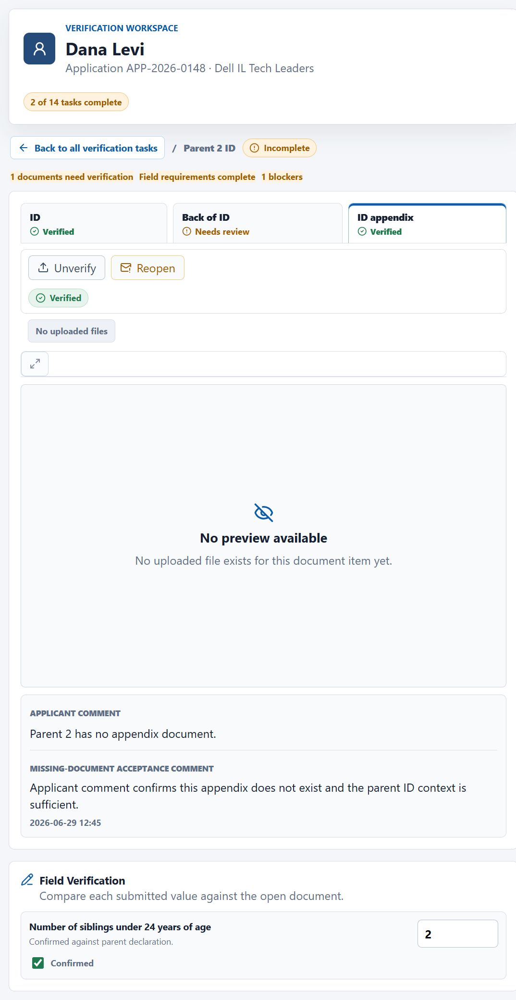
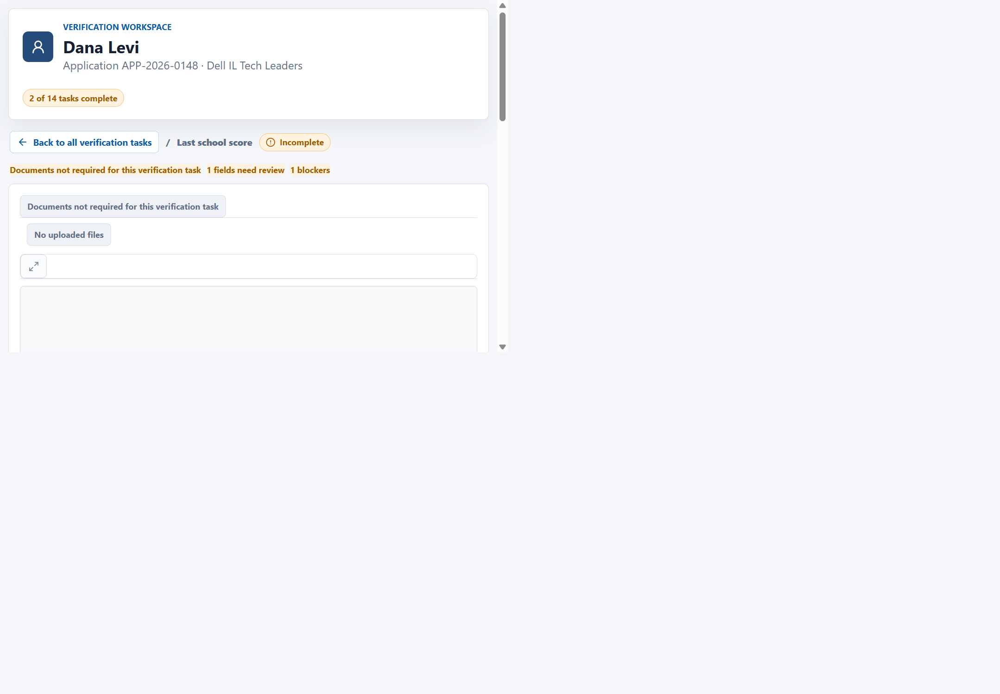
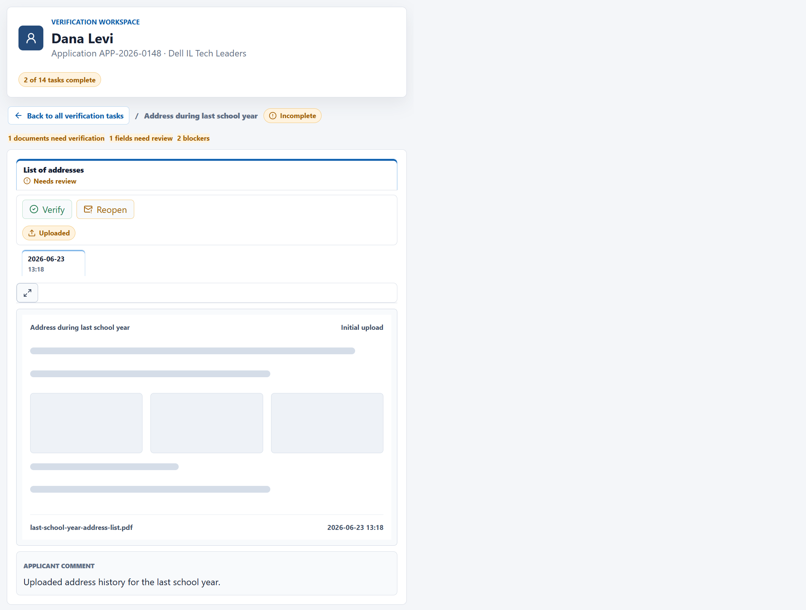

# Screenshot Reference

Use these screenshots as visual and interaction references for the Salesforce LWC build. They show the required reviewer workflow, state visibility, validation behavior, and field-only task handling. They are not pixel-perfect implementation specs.

## Summary and Navigation

### 01 Summary

Shows applicant identity, application reference, program, derived progress, and all verification task cards with document/field completion and missing-work text.

### 02 Applicant ID Uploaded Actions

Shows a document-backed drilldown with document tabs, uploaded-file tabs, preview placeholder, applicant comment, Verify/Reopen actions for an `Uploaded` document, and confirmation fields.

## Reopen Flow

### 03 Reopen Comment Required

Shows the inline correction request draft and required-comment validation before a Reopen state change is allowed.

### 04 Reopened Notification

Shows the result after sending a correction request: state changes to `Reopened`, the latest sent comment is visible, and notification feedback appears.

### 08 Reopened Sent Comment

Shows an existing `Reopened` document with a control to view the latest sent correction comment while waiting for candidate correction.

## Missing Document Flow

### 05 Doesn't Exist Acceptance

Shows a `Doesn't exist` document with no preview, applicant comment context, and Verify/Reopen actions.

### 06 Acceptance Comment Required

Shows the required missing-document acceptance comment before a `Doesn't exist` or `Not uploaded` document can be verified.

### 07 Accepted Missing Document

Shows the result after accepting a missing document: state changes to `Verified` and the acceptance comment remains visible.

## Field and Override Tasks

### 09 Last School Field-Only

Shows the field-only task with no required documents, no document actions, read-only official fields, and a required override field.

### 10 Address Override

Shows a document-backed address task with read-only lookup fields, blank official address score, and required address score override field.

